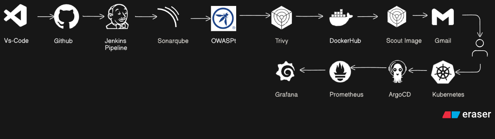

# DevSecOps Project: CI/CD Pipeline with Security and Monitoring

This project implements a complete DevSecOps pipeline using Jenkins for CI/CD, integrated with security scanning tools like SonarQube, OWASP Dependency-Check, Trivy, Docker image analysis, and a monitoring stack using Prometheus and Grafana. ArgoCD is used for GitOps-based deployment on a Kubernetes cluster.

---

## Architecture Diagram

## 🛠️ Tools & Technologies

| Category         | Tools/Services Used |
|------------------|---------------------|
| Code Repository  | GitHub              |
| CI/CD            | Jenkins             |
| Code Quality     | SonarQube           |
| Vulnerability Scanning | OWASP Dependency Check, Trivy |
| Image Scanning   | Docker Scout        |
| Container Registry | DockerHub         |
| Deployment       | Helm, ArgoCD        |
| Monitoring       | Prometheus, Grafana |
| Notification     | Gmail (email alerting) |
| Source Control   | VS Code             |

---

## 🔁 Pipeline Flow

1. **VS Code to GitHub**: Code is pushed to a GitHub repository.
2. **Jenkins Pipeline**:
    - Checks out the code.
    - Runs **SonarQube analysis** for code quality and bug detection.
    - Uses **OWASP Dependency-Check** to scan for vulnerable packages.
    - Executes **Trivy** to identify vulnerabilities in Docker images.
3. **Build and Push**:
    - Builds Docker image.
    - Pushes to **DockerHub**.
    - Scans pushed image using **Docker Scout**.
4. **Deployment**:
    - Uses **Helm** charts.
    - ArgoCD automatically pulls the Helm manifests and deploys them to Kubernetes.
5. **Monitoring & Alerts**:
    - Prometheus scrapes metrics from K8s pods.
    - Grafana visualizes the metrics.
    - Gmail notifications are triggered based on metrics/alerts.

---

## 📊 Monitoring Dashboard

- Prometheus collects pod metrics (CPU, memory, availability).
- Grafana dashboards visualize application health and alert thresholds.

---

## 🔐 Security Features

- **Code Quality Gate** via SonarQube.
- **Static Dependency Scanning** with OWASP.
- **Docker Image Vulnerability Scanning** using Trivy and Docker Scout.
- **Manual Approval Gate** before production deployment (optional).

---

## 📬 Notifications

- Gmail notifications can be configured via SMTP plugin in Jenkins or from ArgoCD Alerts.

---

## Project Documentation

Refer to this text file it has detailed documentation how to create this project.
[text](<This Project Complete Readme.txt>)

---
## SonarQube

## SonarQube Webhook

---

## Jenkins Pipeline

---

## ArgoCd Deployment

---

## Prometheus Monitoring

---

## Website

## 👨‍💻 Author

Lovish Barber – [GitHub](https://github.com/lovish69)

---

## 📜 License

This project is licensed under the MIT License.
